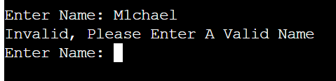

# MEMORY GAME
This is a game designed for a Python terminal, running on Heroku provided by Code Institute.

Players are presented with a randomised 5 Digit Number that disappear and must test their memory capabilities and match it.
It is targeted at an audience that wishes to train or improve on their memory skills.

# LOGIC

A flow digaram of an overview of how the logic of the game functions was made using [Lucid Chart](https://www.lucidchart.com/pages)

## Rules
The rules are simple. Repeat the sequence that was shown 5 times. Anything less than 3 correct answers ends in failure.

# Features
## Existing Features
* Greetings message to the user with the rules.

* Name input box to start the game.

* Error message on invalid entry input to Name input box.

* Randomised Number of digits for the user to remeber.

* Sequence dissappears after 5 seconds.

* User guess and message returns correct or incorrect with the sequence it was.

* Message shows if the user won or lost.

* Message if the user wishes to continue with either a 'Y' or 'N'

## Future Features
 * Sequence is on the screen for less time.
 * Pass rate is raised to all guesses must be correct.

# Languages Used
- Python - For programming the game.
- Markdown - For the README.md file

# Testing
Manual testing was carried out with:
* Code vaidated through PEP8 linter.
* Inputs checked for validity by testing, numbers that are not within limits and inputing strings instead of numbers and vise vera entering integers instead of strings
* Tested on both local and Heroku terminal.

## Validator Testing
* No errors reported through PEP8online.com

# Deployment
* Create a new Heoku App
* Set buildpacks - Python then NodeJS
* Link Heroku App to repository.
* Click Deploy.
* Deploy Branch.
* Open App (At the top of the page).
* A live version of the game can be found here(https://mem-game-da6ccc61cfdb.herokuapp.com/)

# Credits
* I used the BattleShip game, as inspiration for layout and various codes and functions, from the Portfolio 3 section at[Code Institute](https://learn.codeinstitute.net/courses/course-v1:CodeInstitute+PE_PAGPPF+2021_Q2/courseware/b3378fc1159e43e3b70916fdefdfae51/605f34e006594dc4ae19f5e60ec75e2e/).
* My mentor Okwudiri Okoro, helped me with this idea and gave valueable guidance and feedback.
* For the Limited Guess function [Stack Overflow](https://stackoverflow.com/questions/67260876/guessing-projects-how-to-add-guess-limit-python/) was used.
* Another inspiration for layout and code, such as number of guesses was [Djangocentral](https://djangocentral.com/creating-a-guessing-game-in-python/).
* Learning more on Modules was achieved through[W3Schools](https://www.w3schools.com/python/python_modules.asp/).
    - Along with the Time and Sleep module through[GeeksforGeeks](https://www.geeksforgeeks.org/python-time-module/) & [Python](https://docs.python.org/3/library/datetime.html/)
    - I gained further understanding of the Random Module through[Code Instiute](https://learn.codeinstitute.net/courses/course-v1:CodeInstitute+CPP_06_20+2020_T1/courseware/272f493b4d57445fbd634e7ceca3a98c/4ab3e01af44f4bf2828739c1d0591a45/) & [Python.org](https://docs.python.org/3/library/random.html/).
    - As well as the System Module from [GeekforGeeks](https://www.geeksforgeeks.org/python-sys-module/).
* Learning how to clear the screen was achieved also from [GeeksforGeeks](https://www.geeksforgeeks.org/clear-screen-python/).
* Other inspirtaions came from YouTube videos such as [Tech With Tim](https://www.youtube.com/watch?v=J9RQcF7hhgA/) & [Case Digital](https://www.youtube.com/watch?v=XlZDv2BgTk4/)
* To understand Error Handling more i used[W3Schools](https://www.w3schools.com/python/gloss_python_error_handling.asp/), [Stack Overflow](https://stackoverflow.com/questions/28377995/exception-handling-how-to-handle-invalid-datatype-in-user-input/) & [GeeksforGeeks](https://www.geeksforgeeks.org/python-exception-handling/).
* When needing to validate empty or invalid input data, with code such as .isaplpha i used [W3Schools](https://www.w3schools.com/python/ref_string_isalpha.asp/)
* The underscore that was needed for the for loop was researched through [CodeAcademy](https://discuss.codecademy.com/t/use-of-in-range/602290/)